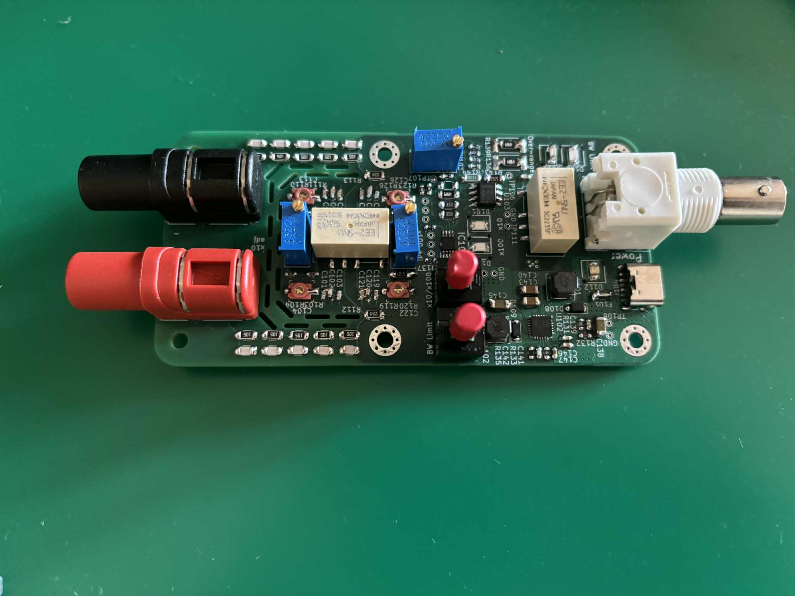
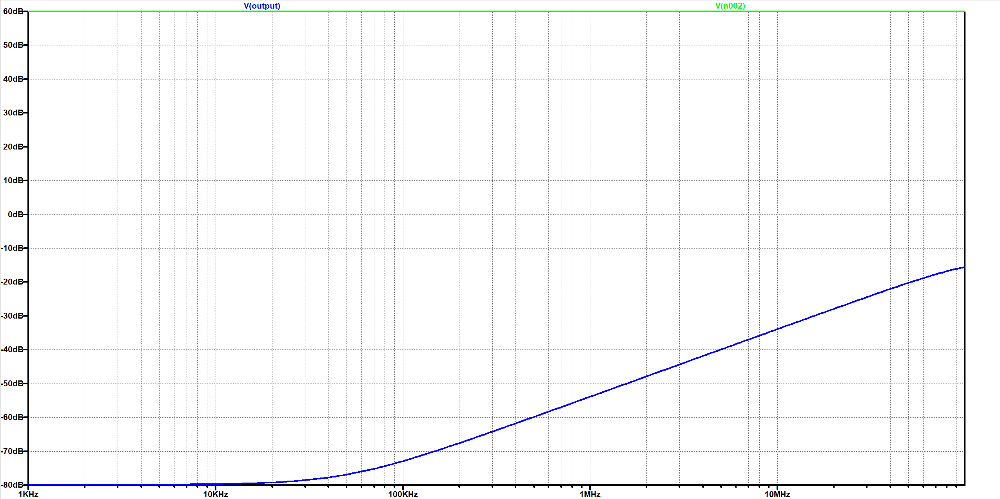
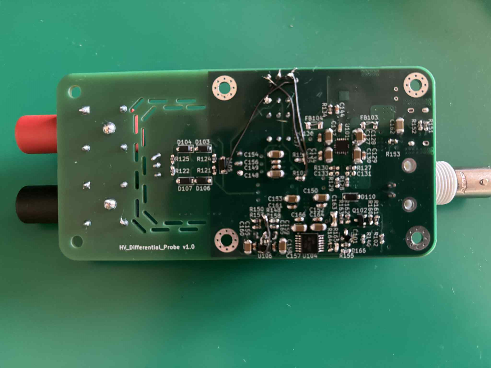
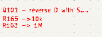

# Differential-Probe
 Purpose of this project was to design low cost differential probe with attenuations of x10 and x100 
 to measure voltages up to 1kV with bandwidth of atleast 10MHz. Input range for x100 attenuation is 1kV, for x10 it is 100V.
 Simulated bandwidth of this probe is estimated at 100MHz.
 Testing only proved bandwidth of 25MHz as it is limited by Analog Discovery 2 network analyzer max frequency. 
 Cost per 1 unit is below 100 euro. 
 Power is delivered by USB-C.
 

## Design description

### Bandwidth and CMRR

Device is based on AD8130 differential amplifier and THS3491 amplifier on output stage.

Bandwidth according to simulation is above 100MHz:

CMRR is 65dB in worst case, 140dB for DC and frequencies below 20kHz:

Gain of the amplifying stage is constant at 10. Attenuation is switched between 1000 and 100 by relay.

### Input protection
Input protection is done by 1N4148 diodes as they have really low parasitic capacitance. 
As maximum differential input voltage for AD8130 is 8.4V
they are connected to resistor dividers ensuring 8V is not exceeded in case of 5 times of maximum voltage input 

Simulated plot for x10 attenuation with 2kV input:

### Offset adjustment 

DC offset can be adjusted by introducing small DC voltage to non inverting input of output amplifier. 

### Bandwidth limiting filter

Device is equipped with switchable 5MHz output low pass filter

## Bring up guide 

### Soldering and rework

Version v1.0 has wrong pinout for U106, Q101, and SW101. To rework U106 and SW101 some traces must be cut. 
All design important notes for fixes in reference to original design are written in red in schematics file. 

### Power rails

Voltages on Test points TP110 and TP111 should provide really clean and stable 11.9V voltage. 

### DC Attenuator

To achieve even attenuation for positive and negative input, remove resistors R137 and R138, force DC voltage floating from probe power supply ground and adjust potentiometers RV101 for x10 and RV102 for x100 so voltages between GND and test points TP103 and TP104 are equal. 

### AC attenuator 

Using device with Bode Plot funcionality, for example Analog Discovery 2, connect generator to positive input and coaxial shield to negative, and adjust variable capacitors on positive side of attenuator for flat frequency response:

Example of unadjusted probe

After adjusting:

Repeat with switched positive and negative input for both x10 and x100.  

Note: AD2 max bandwidth is 25MHz: 

On this step, 5MHz output filter can also be checked and adjusted.

### Offset trim

Short positive and negative inputs and connect DMM to the output. Adjust potentiometer RV103 to achieve near-zero offset.

